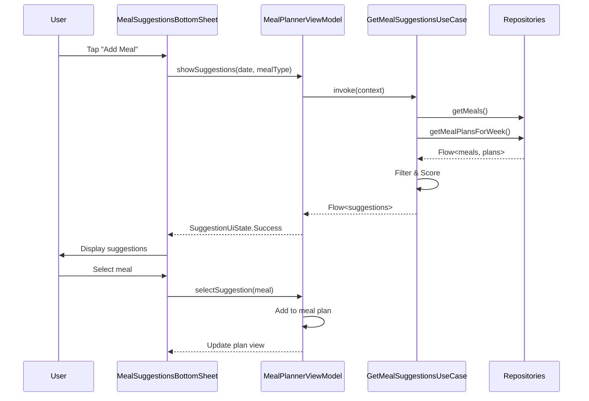
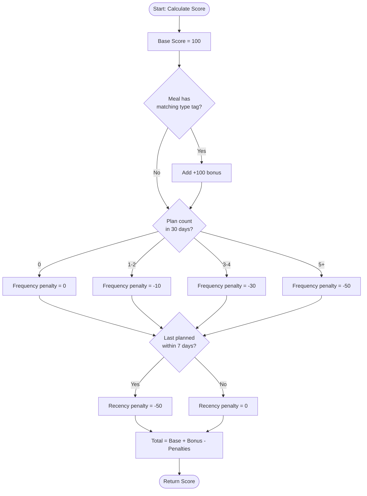
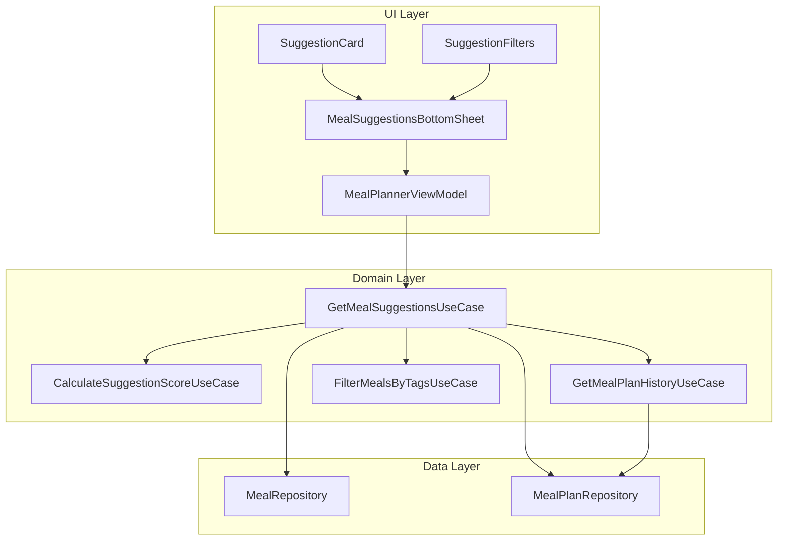

# Design Document

## Overview

The Meal Suggestions feature provides intelligent meal recommendations to enhance the meal planning experience. The system analyzes meal history, user preferences, tags, and contextual information to suggest relevant meals when users are planning their week. The design follows Clean Architecture principles with clear separation between domain logic, data access, and UI presentation.

## Architecture

### Layer Organization

```
UI Layer (Presentation)
├── MealSuggestionsBottomSheet (Composable)
├── SuggestionCard (Composable)
├── SuggestionFilters (Composable)
└── MealPlannerViewModel (Enhanced)

Domain Layer (Business Logic)
├── GetMealSuggestionsUseCase
├── CalculateSuggestionScoreUseCase
├── GetMealPlanHistoryUseCase
└── Models: MealSuggestion, SuggestionContext, SuggestionScore

Data Layer (Data Access)
└── Existing repositories (no changes needed)
```

### Design Principles

1. **Offline-First**: All suggestion calculations happen locally using cached data
2. **Reactive**: Use Flow for real-time updates when meal plans or meals change
3. **Performance**: Efficient scoring algorithm with caching for smooth UX
4. **Extensibility**: Modular design allows adding new scoring factors easily
5. **Testability**: Pure functions for scoring logic, mockable dependencies

## Components and Interfaces

### Domain Models

#### MealSuggestion

```kotlin
/**
 * Represents a meal suggestion with its relevance score and metadata.
 *
 * @property meal The suggested meal
 * @property score The calculated relevance score (0-300)
 * @property reasons List of human-readable reasons why this meal was suggested
 * @property lastPlannedDate The date this meal was last planned (null if never)
 * @property planCount Number of times this meal was planned in the past 30 days
 */
data class MealSuggestion(
    val meal: Meal,
    val score: Double,
    val reasons: List<String>,
    val lastPlannedDate: LocalDate?,
    val planCount: Int
)
```

#### SuggestionContext

```kotlin
/**
 * Context information for generating meal suggestions.
 *
 * @property targetDate The date for which suggestions are requested
 * @property targetMealType The meal type (breakfast, lunch, dinner, snack)
 * @property selectedTags User-selected tag filters
 * @property searchQuery Optional search text to filter by meal name
 * @property existingPlanIds IDs of meals already planned for the week (to avoid duplicates)
 */
data class SuggestionContext(
    val targetDate: LocalDate,
    val targetMealType: MealType,
    val selectedTags: Set<MealTag> = emptySet(),
    val searchQuery: String = "",
    val existingPlanIds: Set<Long> = emptySet()
)
```

#### SuggestionScore

```kotlin
/**
 * Detailed breakdown of a suggestion score calculation.
 *
 * @property baseScore Starting score (100)
 * @property mealTypeBonus Bonus for matching meal type (0-100)
 * @property frequencyPenalty Penalty for frequent use (0-50)
 * @property recencyPenalty Penalty for recent use (0-50)
 * @property totalScore Final calculated score
 */
data class SuggestionScore(
    val baseScore: Double = 100.0,
    val mealTypeBonus: Double = 0.0,
    val frequencyPenalty: Double = 0.0,
    val recencyPenalty: Double = 0.0
) {
    val totalScore: Double
        get() = baseScore + mealTypeBonus - frequencyPenalty - recencyPenalty
}
```

#### MealPlanHistory

```kotlin
/**
 * Historical data about a meal's planning patterns.
 *
 * @property mealId The meal ID
 * @property lastPlannedDate The most recent date this meal was planned
 * @property planCount Number of times planned in the analysis period
 * @property planDates List of dates when this meal was planned
 */
data class MealPlanHistory(
    val mealId: Long,
    val lastPlannedDate: LocalDate?,
    val planCount: Int,
    val planDates: List<LocalDate>
)
```

### Use Cases

#### GetMealSuggestionsUseCase

```kotlin
/**
 * Primary use case for generating meal suggestions.
 * Orchestrates the suggestion generation process by:
 * 1. Fetching all meals and meal plans
 * 2. Filtering meals based on context (tags, search)
 * 3. Calculating scores for each meal
 * 4. Ranking and limiting results
 *
 * Requirements: 1.1, 1.2, 1.3, 2.1-2.5, 3.1-3.5, 4.1-4.5, 5.1-5.5, 6.1-6.5
 */
class GetMealSuggestionsUseCase @Inject constructor(
    private val mealRepository: MealRepository,
    private val mealPlanRepository: MealPlanRepository,
    private val calculateScoreUseCase: CalculateSuggestionScoreUseCase,
    private val getHistoryUseCase: GetMealPlanHistoryUseCase,
    private val filterByTagsUseCase: FilterMealsByTagsUseCase
) {
    operator fun invoke(context: SuggestionContext): Flow<Result<List<MealSuggestion>>>
}
```

**Algorithm:**
1. Fetch all meals from repository
2. Apply tag filters if selected
3. Apply search query filter if provided
4. Exclude meals already planned for the week
5. Get meal plan history for scoring
6. Calculate score for each remaining meal
7. Sort by score descending, then by name
8. Limit to top 10 results
9. Return as Flow for reactive updates

#### CalculateSuggestionScoreUseCase

```kotlin
/**
 * Calculates the relevance score for a meal suggestion.
 * Pure function with no side effects for easy testing.
 *
 * Scoring Formula:
 * - Base Score: 100
 * - Meal Type Match: +100 (if meal has matching meal type tag)
 * - Frequency Penalty: -0 to -50 (based on plan count in past 30 days)
 *   - 0 times: 0 penalty
 *   - 1-2 times: -10 penalty
 *   - 3-4 times: -30 penalty
 *   - 5+ times: -50 penalty
 * - Recency Penalty: -50 (if planned within past 7 days)
 *
 * Requirements: 3.1-3.5, 4.1-4.3, 6.1-6.4
 */
class CalculateSuggestionScoreUseCase @Inject constructor() {
    operator fun invoke(
        meal: Meal,
        context: SuggestionContext,
        history: MealPlanHistory
    ): SuggestionScore
}
```

#### GetMealPlanHistoryUseCase

```kotlin
/**
 * Retrieves historical meal planning data for scoring.
 * Analyzes meal plans from the past 30 days to determine:
 * - How many times each meal was planned
 * - When each meal was last planned
 *
 * Requirements: 3.1-3.5
 */
class GetMealPlanHistoryUseCase @Inject constructor(
    private val mealPlanRepository: MealPlanRepository
) {
    suspend operator fun invoke(): Result<Map<Long, MealPlanHistory>>
}
```

### UI Components

#### MealSuggestionsBottomSheet

```kotlin
/**
 * Bottom sheet displaying meal suggestions with filters and search.
 * Integrates with the meal planning flow.
 *
 * Features:
 * - Search bar for filtering by name
 * - Tag filter chips
 * - Suggestion cards with scores and metadata
 * - Empty states for no meals/no matches
 * - Loading states
 * - Error handling with retry
 *
 * Requirements: 1.1-1.5, 2.1-2.5, 5.1-5.5, 7.1-7.5, 8.1-8.5, 9.1-9.5, 10.1-10.5
 */
@Composable
fun MealSuggestionsBottomSheet(
    context: SuggestionContext,
    onMealSelected: (Meal) -> Unit,
    onDismiss: () -> Unit,
    onBrowseAll: () -> Unit,
    modifier: Modifier = Modifier
)
```

#### SuggestionCard

```kotlin
/**
 * Card displaying a single meal suggestion.
 *
 * Displays:
 * - Meal name
 * - Meal type tags
 * - Ingredient count
 * - Last planned date (if applicable)
 * - Visual indicator for high-scoring suggestions
 *
 * Requirements: 4.4, 6.4
 */
@Composable
fun SuggestionCard(
    suggestion: MealSuggestion,
    onClick: () -> Unit,
    onViewDetails: () -> Unit,
    modifier: Modifier = Modifier
)
```

#### SuggestionFilters

```kotlin
/**
 * Filter chips for tag-based filtering.
 *
 * Features:
 * - Displays all available meal tags
 * - Shows count of meals for each tag
 * - Multi-select with visual feedback
 * - Persists selections during session
 *
 * Requirements: 2.1-2.5, 9.1-9.2
 */
@Composable
fun SuggestionFilters(
    availableTags: List<MealTag>,
    selectedTags: Set<MealTag>,
    mealCountByTag: Map<MealTag, Int>,
    onTagToggle: (MealTag) -> Unit,
    modifier: Modifier = Modifier
)
```

### ViewModel Integration

#### MealPlannerViewModel Enhancement

```kotlin
/**
 * Enhanced ViewModel with suggestion state management.
 */
@HiltViewModel
class MealPlannerViewModel @Inject constructor(
    // Existing dependencies...
    private val getMealSuggestionsUseCase: GetMealSuggestionsUseCase
) : ViewModel() {
    
    // Existing state...
    
    // New suggestion state
    private val _suggestionState = MutableStateFlow<SuggestionUiState>(SuggestionUiState.Hidden)
    val suggestionState: StateFlow<SuggestionUiState> = _suggestionState.asStateFlow()
    
    private val _suggestionContext = MutableStateFlow<SuggestionContext?>(null)
    
    private val _selectedTags = MutableStateFlow<Set<MealTag>>(emptySet())
    
    private val _searchQuery = MutableStateFlow("")
    
    fun showSuggestions(date: LocalDate, mealType: MealType)
    
    fun updateTagFilter(tag: MealTag)
    
    fun updateSearchQuery(query: String)
    
    fun selectSuggestion(meal: Meal)
    
    fun hideSuggestions()
}

sealed interface SuggestionUiState {
    data object Hidden : SuggestionUiState
    data object Loading : SuggestionUiState
    data class Success(
        val suggestions: List<MealSuggestion>,
        val context: SuggestionContext
    ) : SuggestionUiState
    data class Error(val message: String) : SuggestionUiState
    data class Empty(val reason: EmptyReason) : SuggestionUiState
}

enum class EmptyReason {
    NO_MEALS,
    NO_MATCHES,
    ALL_PLANNED
}
```

## Data Models

### No New Entities Required

The suggestion feature uses existing entities:
- `MealEntity` (from meal management)
- `MealPlanEntity` (from meal planning)

All suggestion data is calculated in-memory and not persisted.

## Error Handling

### Error Scenarios

1. **No Meals in Library**
   - Display empty state with "Create your first meal" CTA
   - Gracefully handle with EmptyReason.NO_MEALS

2. **No Matching Meals**
   - Display "No meals match your filters" message
   - Suggest adjusting filters or browsing all meals
   - Gracefully handle with EmptyReason.NO_MATCHES

3. **All Meals Already Planned**
   - Display "All meals are already planned this week" message
   - Suggest browsing all meals anyway
   - Gracefully handle with EmptyReason.ALL_PLANNED

4. **Repository Errors**
   - Catch exceptions in use case
   - Map to AppError types
   - Display error message with retry option
   - Log errors for debugging

5. **Calculation Errors**
   - Fallback to simple alphabetical sorting
   - Log error but don't block user
   - Degrade gracefully

### Error Handling Pattern

```kotlin
try {
    // Fetch data and calculate suggestions
    val suggestions = calculateSuggestions(context)
    
    if (suggestions.isEmpty()) {
        emit(Result.success(emptyList()))
    } else {
        emit(Result.success(suggestions))
    }
} catch (e: Exception) {
    Timber.e(e, "Error generating suggestions")
    emit(Result.failure(AppError.UnknownError(
        message = "Failed to load suggestions",
        cause = e
    )))
}
```

## Testing Strategy

### Unit Tests

#### CalculateSuggestionScoreUseCase Tests
- Test base score calculation
- Test meal type bonus application
- Test frequency penalty calculation
- Test recency penalty calculation
- Test score formula accuracy
- Test edge cases (no history, never planned)

#### GetMealSuggestionsUseCase Tests
- Test filtering by tags
- Test filtering by search query
- Test excluding already planned meals
- Test score-based ranking
- Test limit to 10 results
- Test empty result scenarios
- Test error handling

#### GetMealPlanHistoryUseCase Tests
- Test history calculation from meal plans
- Test date range filtering (30 days)
- Test grouping by meal ID
- Test empty history handling

### Integration Tests

#### Suggestion Flow Tests
- Test end-to-end suggestion generation
- Test with real repository data
- Test reactive updates when plans change
- Test performance with large datasets

### UI Tests

#### MealSuggestionsBottomSheet Tests
- Test display of suggestions
- Test tag filter interaction
- Test search functionality
- Test meal selection
- Test empty states
- Test error states
- Test loading states

## Performance Considerations

### Optimization Strategies

1. **Caching**
   - Cache meal plan history for current session
   - Invalidate cache when plans are added/removed
   - Cache suggestion results for same context

2. **Lazy Calculation**
   - Calculate scores only for filtered meals
   - Limit to top 10 results early
   - Use sequence operations for efficiency

3. **Background Processing**
   - Perform all calculations on IO dispatcher
   - Use Flow for non-blocking updates
   - Show loading indicator for >300ms operations

4. **Database Optimization**
   - Use existing indexed queries
   - No new database queries needed
   - Leverage Room's Flow caching

### Performance Targets

- Initial load: <500ms (Requirement 7.1)
- Filter update: <200ms (Requirement 7.2)
- Search update: <200ms (real-time)
- Memory usage: <10MB for suggestion data

## Accessibility

### Screen Reader Support

- Announce suggestion count when loaded
- Provide content descriptions for all interactive elements
- Announce filter changes
- Announce search results count

### Keyboard Navigation

- Tab through suggestion cards
- Enter to select suggestion
- Escape to close bottom sheet
- Arrow keys for filter chips

### Visual Accessibility

- Sufficient color contrast for scores
- Clear focus indicators
- Support dynamic text sizing
- Semantic HTML-like structure

## Future Enhancements

### Phase 2 Possibilities

1. **Machine Learning**
   - Learn from user's selection patterns
   - Personalized scoring weights
   - Time-of-day preferences

2. **Seasonal Suggestions**
   - Suggest meals based on season
   - Holiday-themed suggestions

3. **Nutritional Balance**
   - Suggest meals to balance weekly nutrition
   - Track macros and suggest complementary meals

4. **Social Features**
   - Suggest popular meals from community
   - Share and discover meal plans

5. **Smart Reminders**
   - Suggest meals you haven't made in a while
   - Remind about favorite meals

## Dependencies

### New Dependencies
None - uses existing dependencies

### Existing Dependencies
- Hilt for dependency injection
- Room for data persistence
- Kotlin Coroutines and Flow for async operations
- Jetpack Compose for UI
- Material3 for design components

## Migration Strategy

### Implementation Phases

**Phase 1: Core Logic (Week 1)**
- Implement domain models
- Implement use cases
- Write unit tests
- Verify scoring algorithm

**Phase 2: UI Components (Week 1)**
- Implement bottom sheet
- Implement suggestion cards
- Implement filters
- Write UI tests

**Phase 3: Integration (Week 2)**
- Integrate with MealPlannerViewModel
- Connect to existing meal planning flow
- Test end-to-end
- Performance testing

**Phase 4: Polish (Week 2)**
- Accessibility improvements
- Error handling refinement
- Empty state polish
- Documentation

### Rollout Strategy

1. **Internal Testing**
   - Test with various meal library sizes
   - Test with different planning patterns
   - Verify performance targets

2. **Beta Release**
   - Release to subset of users
   - Gather feedback on suggestion relevance
   - Monitor performance metrics

3. **Full Release**
   - Roll out to all users
   - Monitor error rates
   - Collect usage analytics

## Diagrams

### Suggestion Flow Diagram



### Scoring Algorithm Flowchart



### Component Architecture



## Summary

The Meal Suggestions feature enhances the meal planning experience by providing intelligent, context-aware meal recommendations. The design follows Clean Architecture principles with clear separation of concerns, uses existing infrastructure, and requires no database changes. The scoring algorithm balances multiple factors (meal type, frequency, recency) to provide relevant suggestions while maintaining variety. The implementation is testable, performant, and extensible for future enhancements.
