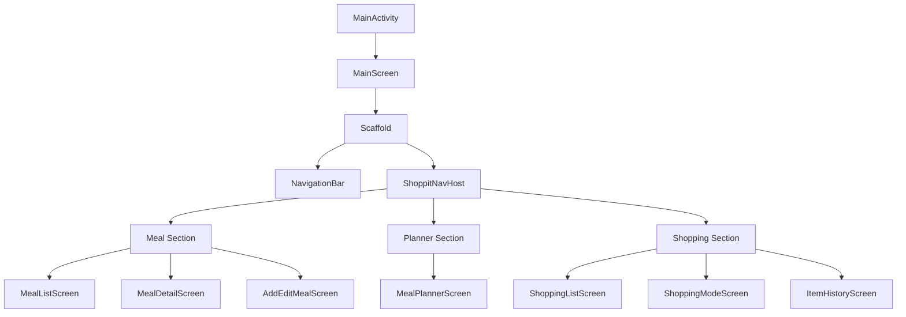
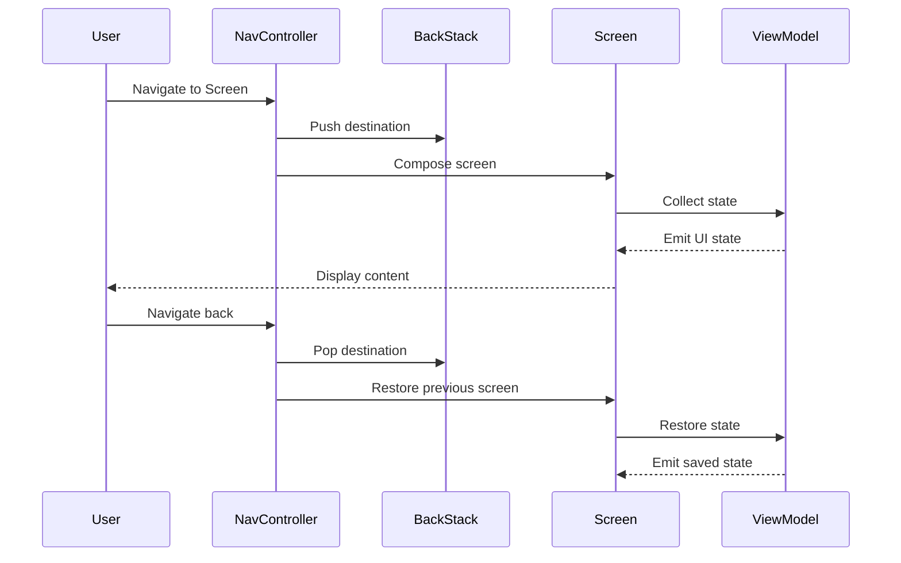

# Design Document

## Overview

The navigation and UI design for Shoppit follows a hierarchical structure with bottom navigation for primary sections and stack-based navigation for detail screens. The implementation uses Jetpack Compose Navigation with Material3 components, providing a modern, type-safe navigation system that integrates seamlessly with the app's MVVM architecture.

The design leverages existing navigation infrastructure while ensuring proper state management, smooth transitions, and accessibility compliance. The navigation system is built around three main sections (Meals, Planner, Shopping), each with its own navigation stack and state preservation.

## Architecture

### Navigation Structure

```
MainScreen (Scaffold with Bottom Navigation)
├── MealList (Bottom Nav Item 1)
│   ├── MealDetail
│   ├── AddMeal
│   └── EditMeal
├── MealPlanner (Bottom Nav Item 2)
│   └── MealDetail (shared)
└── ShoppingList (Bottom Nav Item 3)
    ├── MealDetail (shared)
    ├── ItemHistory
    ├── TemplateManager
    ├── StoreSectionEditor
    └── ShoppingMode
```

### Component Hierarchy



### State Management Flow



## Components and Interfaces

### 1. Navigation Components

#### Screen (Sealed Class)
**Purpose:** Type-safe navigation destinations with route definitions

**Existing Implementation:**
```kotlin
sealed class Screen(val route: String) {
    data object MealList : Screen("meal_list")
    data object MealDetail : Screen("meal_detail/{mealId}") {
        fun createRoute(mealId: Long): String
    }
    data object AddMeal : Screen("add_meal")
    data object EditMeal : Screen("edit_meal/{mealId}") {
        fun createRoute(mealId: Long): String
    }
    data object MealPlanner : Screen("meal_planner")
    data object ShoppingList : Screen("shopping_list")
    data object ItemHistory : Screen("item_history")
    data object TemplateManager : Screen("template_manager")
    data object StoreSectionEditor : Screen("store_section_editor")
    data object ShoppingMode : Screen("shopping_mode")
}
```

**Design Decisions:**
- Uses sealed class for compile-time safety
- Parameterized routes use companion object functions for type safety
- Route strings follow snake_case convention
- Each screen has a unique, descriptive route identifier

#### BottomNavigationItem (Sealed Class)
**Purpose:** Define bottom navigation bar items with icons and labels

**Existing Implementation:**
```kotlin
sealed class BottomNavigationItem(
    val route: String,
    val title: String,
    val icon: ImageVector
) {
    data object Meals : BottomNavigationItem(...)
    data object Planner : BottomNavigationItem(...)
    data object Shopping : BottomNavigationItem(...)
    
    companion object {
        val items = listOf(Meals, Planner, Shopping)
    }
}
```

**Design Decisions:**
- Three primary navigation items matching product requirements
- Material Icons for consistent visual language
- Companion object provides easy iteration for UI rendering
- Routes map directly to Screen objects for consistency

#### ShoppitNavHost (Composable)
**Purpose:** Central navigation host managing all app destinations

**Key Responsibilities:**
- Define all navigation routes and their composable screens
- Handle navigation arguments (e.g., mealId)
- Manage navigation callbacks between screens
- Coordinate with ViewModels for data flow

**Navigation Patterns:**
```kotlin
// Simple navigation
navController.navigate(Screen.MealList.route)

// Navigation with arguments
navController.navigate(Screen.MealDetail.createRoute(mealId))

// Navigation with back stack management
navController.navigate(route) {
    popUpTo(navController.graph.findStartDestination().id) {
        saveState = true
    }
    launchSingleTop = true
    restoreState = true
}

// Pop back stack
navController.popBackStack()
```

#### MainScreen (Composable)
**Purpose:** Root screen with bottom navigation and content area

**Structure:**
```kotlin
@Composable
fun MainScreen() {
    val navController = rememberNavController()
    val navBackStackEntry by navController.currentBackStackEntryAsState()
    val currentDestination = navBackStackEntry?.destination
    
    Scaffold(
        bottomBar = { NavigationBar { /* items */ } }
    ) { innerPadding ->
        ShoppitNavHost(navController, Modifier.padding(innerPadding))
    }
}
```

**Design Decisions:**
- Scaffold provides Material3 layout structure
- Bottom bar visibility controlled by current destination
- Inner padding ensures content doesn't overlap with navigation bar
- NavController scoped to MainScreen for proper lifecycle management

### 2. Screen Components

#### Meal Section Screens

**MealListScreen**
- Displays all meals in a scrollable list
- Floating action button for adding new meals
- Click handlers for navigation to detail and add screens
- Empty state when no meals exist

**MealDetailScreen**
- Shows meal information with ingredients
- Edit and delete action buttons in top app bar
- Navigation callbacks for edit and delete actions
- Loading and error states

**AddEditMealScreen**
- Form for creating or editing meals
- Shared screen with mode determined by presence of mealId
- Save and cancel actions
- Input validation with error messages

#### Planner Section Screens

**MealPlannerScreen**
- Weekly calendar view with meal slots
- Week navigation controls
- Meal assignment dialogs
- Navigation to meal details from planned meals

#### Shopping Section Screens

**ShoppingListScreen**
- Aggregated shopping list with check-off functionality
- Navigation to related screens (history, templates, settings)
- Shopping mode toggle
- Meal source indicators with navigation

**ShoppingModeScreen**
- Simplified interface for active shopping
- Large touch targets for easy interaction
- Exit button to return to normal view

**ItemHistoryScreen**
- Purchase history for quick re-adding
- Search and filter capabilities
- Back navigation to shopping list

**TemplateManagerScreen**
- Create, load, and delete shopping templates
- Template preview before loading
- Back navigation to shopping list

**StoreSectionEditor**
- Customize store section order
- Create custom sections
- Drag-and-drop reordering
- Back navigation to shopping list

### 3. Navigation State Management

#### State Preservation Strategy

**Bottom Navigation State:**
- Each bottom nav item maintains independent back stack
- State saved when switching between tabs
- State restored when returning to tab
- Implemented via `saveState` and `restoreState` in navigation options

**Screen State:**
- ViewModels survive configuration changes
- Scroll positions preserved via `rememberSaveable`
- Form inputs saved in ViewModel state
- Database queries cached in repositories

**Back Stack Management:**
- Single top launch mode prevents duplicate screens
- Pop up to start destination for bottom nav items
- Proper back stack construction for deep links
- Clear back stack on logout or data reset

#### Navigation Arguments

**Type-Safe Arguments:**
```kotlin
// Define argument in route
composable(
    route = Screen.MealDetail.route,
    arguments = listOf(
        navArgument("mealId") {
            type = NavType.LongType
        }
    )
) { backStackEntry ->
    val mealId = backStackEntry.arguments?.getLong("mealId")
    MealDetailScreen(mealId = mealId)
}
```

**Argument Validation:**
- Required arguments throw exception if missing
- Optional arguments provide default values
- Type safety enforced at compile time
- Runtime validation in ViewModels

## Data Models

### Navigation Models

**NavBackStackEntry**
- Provided by Compose Navigation
- Contains destination, arguments, and saved state
- Lifecycle-aware for proper cleanup

**SavedStateHandle**
- Injected into ViewModels
- Persists across process death
- Used for navigation arguments and form state

### UI State Models

**Existing UI State Classes:**
- `MealListUiState`: Loading, Success(meals), Error(message)
- `MealDetailUiState`: Loading, Success(meal), Error(message)
- `AddEditMealUiState`: Form state with validation
- `MealPlannerUiState`: Week data with meal plans
- `ShoppingListUiState`: Items, sections, mode, templates

**State Flow Pattern:**
```kotlin
sealed interface ScreenUiState {
    data object Loading : ScreenUiState
    data class Success(val data: Data) : ScreenUiState
    data class Error(val message: String) : ScreenUiState
}
```

## Error Handling

### Navigation Errors

**Missing Arguments:**
```kotlin
val mealId = backStackEntry.arguments?.getLong("mealId")
    ?: run {
        // Log error and navigate to fallback
        navController.popBackStack()
        return@composable
    }
```

**Invalid Routes:**
- Caught by NavController
- Logged for debugging
- User shown error message
- Navigation to safe fallback screen

**State Restoration Failures:**
- Graceful degradation to default state
- User notified if data loss occurs
- Retry mechanism for transient failures

### Screen-Level Errors

**Loading Failures:**
- Error state displayed with retry button
- Error message from ViewModel
- Navigation back option provided

**Save Failures:**
- Error message displayed in snackbar
- Form state preserved for retry
- User can cancel or retry

**Delete Failures:**
- Confirmation dialog before delete
- Error message if delete fails
- State rolled back on failure

## Testing Strategy

### Navigation Testing

**Unit Tests:**
- Screen route generation
- Argument parsing and validation
- Navigation state management
- Back stack behavior

**Integration Tests:**
- Navigation flow between screens
- State preservation across navigation
- Deep link handling
- Back button behavior

**UI Tests:**
```kotlin
@Test
fun navigateToMealDetail_displaysCorrectMeal() {
    composeTestRule.setContent {
        MainScreen()
    }
    
    // Click meal in list
    composeTestRule.onNodeWithText("Pasta").performClick()
    
    // Verify detail screen shown
    composeTestRule.onNodeWithText("Ingredients").assertIsDisplayed()
}
```

### Screen Testing

**Composable Tests:**
- Screen rendering with different states
- User interactions and callbacks
- Accessibility compliance
- Error state handling

**ViewModel Tests:**
- State transitions
- Navigation event emission
- Error handling
- State persistence

### Accessibility Testing

**TalkBack Testing:**
- Screen reader announcements
- Content descriptions
- Focus order
- Navigation feedback

**Keyboard Navigation:**
- Tab order
- Enter key actions
- Escape key for back navigation

## Performance Considerations

### Navigation Performance

**Optimization Strategies:**
- Lazy composition of screens
- Shared ViewModels for related screens
- Preloading frequently accessed data
- Efficient back stack management

**Metrics:**
- Navigation transition time < 300ms
- Frame rate maintained at 60fps during transitions
- Memory usage stable during navigation
- No memory leaks from retained screens

### Screen Performance

**Lazy Loading:**
- LazyColumn for scrollable lists
- Pagination for large datasets
- Image loading with Coil
- Database queries with Flow

**State Management:**
- Minimal recomposition scope
- Stable keys for list items
- Remember expensive computations
- Derived state for computed values

## Accessibility

### Navigation Accessibility

**Screen Reader Support:**
- Descriptive labels for navigation items
- Announcement of screen transitions
- Content descriptions for icons
- Semantic structure for content

**Keyboard Navigation:**
- Tab order follows visual layout
- Enter key activates buttons
- Escape key for back navigation
- Focus indicators visible

**Visual Accessibility:**
- Minimum touch target size: 48dp
- Sufficient color contrast (WCAG AA)
- Text scaling support
- Dark mode support

### Screen Accessibility

**Content Structure:**
- Proper heading hierarchy
- Labeled form inputs
- Error messages associated with inputs
- Loading states announced

**Interactive Elements:**
- Clear focus indicators
- Disabled state communicated
- Action feedback (haptics, sounds)
- Confirmation for destructive actions

## Material3 Integration

### Navigation Components

**NavigationBar:**
- Material3 bottom navigation
- Adaptive colors from theme
- Ripple effects on interaction
- Badge support for notifications

**NavigationBarItem:**
- Icon and label layout
- Selected state styling
- Accessibility labels
- Touch target sizing

### Screen Components

**Scaffold:**
- Top app bar for screen titles
- Bottom navigation bar
- Floating action buttons
- Snackbar host for messages

**TopAppBar:**
- Screen title display
- Navigation icon (back button)
- Action buttons (edit, delete)
- Overflow menu for additional actions

## Deep Link Support

### Deep Link Configuration

**AndroidManifest.xml:**
```xml
<intent-filter>
    <action android:name="android.intent.action.VIEW" />
    <category android:name="android.intent.category.DEFAULT" />
    <category android:name="android.intent.category.BROWSABLE" />
    <data android:scheme="shoppit" android:host="meal" />
</intent-filter>
```

**Navigation Graph:**
```kotlin
composable(
    route = Screen.MealDetail.route,
    deepLinks = listOf(
        navDeepLink { uriPattern = "shoppit://meal/{mealId}" }
    )
) { /* ... */ }
```

### Deep Link Handling

**Supported Deep Links:**
- `shoppit://meal/{mealId}` - Open meal detail
- `shoppit://planner?date={date}` - Open planner at date
- `shoppit://shopping` - Open shopping list
- `shoppit://shopping/mode` - Open shopping mode

**Back Stack Construction:**
- Deep links create proper back stack
- User can navigate back logically
- Invalid deep links handled gracefully

## Implementation Notes

### Existing Implementation Status

**Completed:**
- Screen sealed class with all routes
- BottomNavigationItem with three main sections
- ShoppitNavHost with all navigation routes
- MainScreen with bottom navigation
- MainActivity integration
- All screen composables exist

**Needs Enhancement:**
- Deep link configuration in manifest
- Accessibility improvements
- Performance optimization
- Comprehensive testing
- Error handling refinement
- State preservation edge cases

### Migration Considerations

**No Breaking Changes:**
- Existing navigation structure is sound
- Enhancements are additive
- Backward compatible with current screens

**Enhancement Areas:**
- Add deep link support
- Improve accessibility
- Add navigation analytics
- Enhance error handling
- Add loading states during navigation

## Design Decisions and Rationale

### Why Bottom Navigation?

**Rationale:**
- Three primary sections fit bottom nav pattern
- Frequent switching between sections expected
- Material3 guideline for 3-5 top-level destinations
- Thumb-friendly on mobile devices

### Why Sealed Classes for Routes?

**Rationale:**
- Compile-time safety for navigation
- Exhaustive when expressions
- Type-safe argument passing
- Refactoring support in IDE

### Why Single NavHost?

**Rationale:**
- Simpler state management
- Unified back stack
- Easier deep link handling
- Better performance than nested navigation

### Why State Preservation?

**Rationale:**
- Better user experience
- Prevents data loss
- Maintains scroll positions
- Reduces unnecessary reloading

## Future Enhancements

### Potential Improvements

**Navigation Animations:**
- Custom transitions between screens
- Shared element transitions
- Material motion system integration

**Advanced State Management:**
- Navigation state persistence across app restarts
- Multi-window support for tablets
- Picture-in-picture for shopping mode

**Analytics Integration:**
- Track navigation patterns
- Measure screen engagement
- Identify navigation pain points

**Offline Support:**
- Queue navigation actions when offline
- Sync state when connection restored
- Offline-first navigation experience
