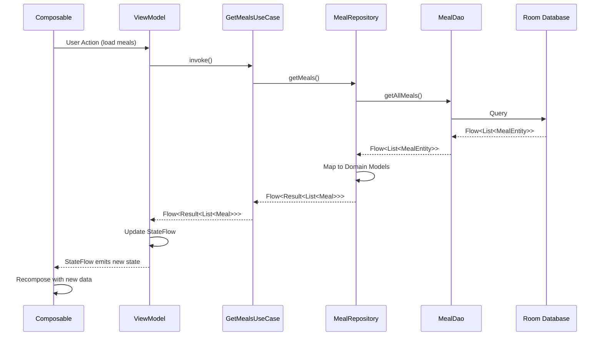
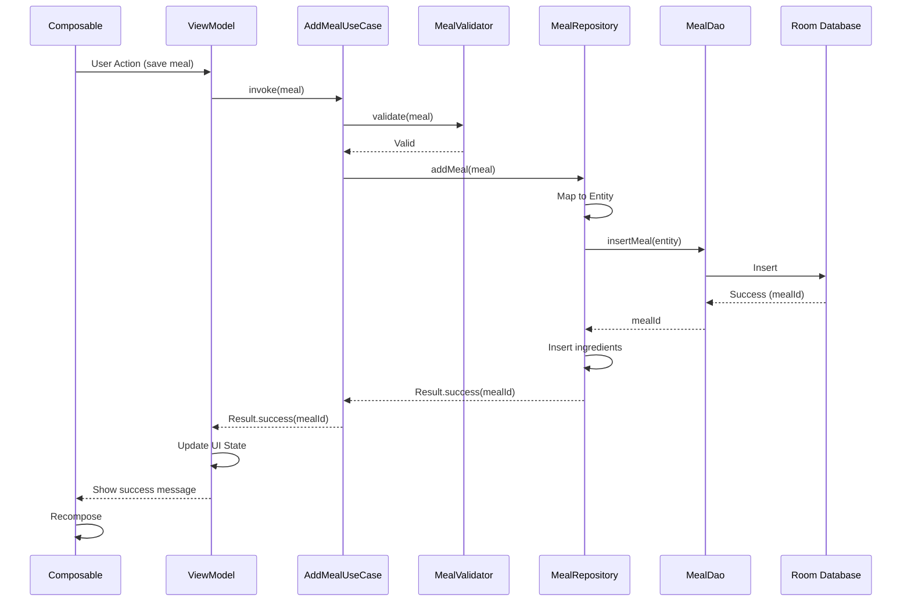
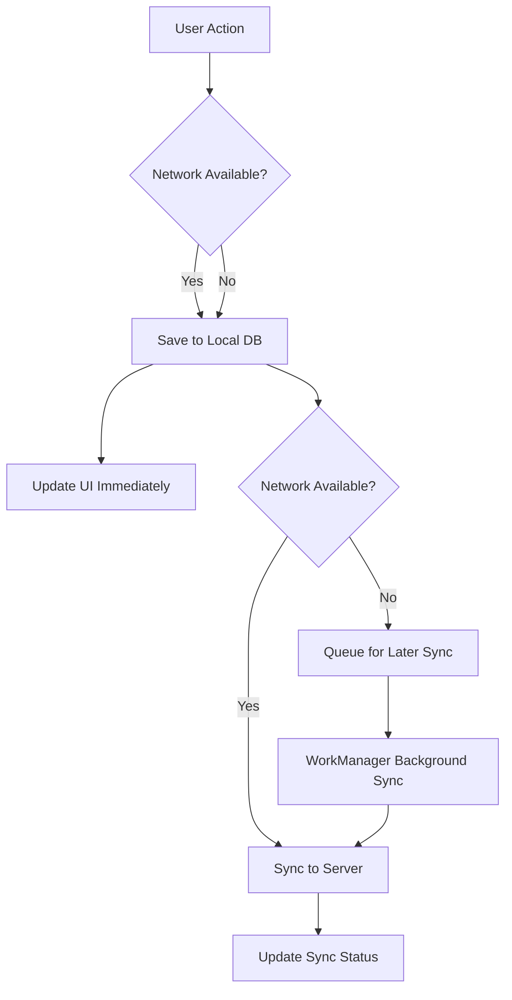

# Data Flow Architecture

Detailed documentation of data movement patterns and repository implementation in the Shoppit application.

## Overview

Shoppit follows an **offline-first** architecture where data flows through well-defined layers, ensuring the app works seamlessly without network connectivity. All data operations go through the repository pattern, which abstracts the data source and provides a clean API for the domain layer.

## Data Flow Principles

### 1. Unidirectional Data Flow
- Data flows in one direction: UI → ViewModel → UseCase → Repository → DataSource
- Updates flow back through reactive streams (Flow/StateFlow)
- No direct communication between non-adjacent layers

### 2. Single Source of Truth
- Room database is the single source of truth
- Network data is cached locally before being exposed to UI
- UI always reads from local database

### 3. Reactive Updates
- Use Kotlin Flow for reactive data streams
- UI automatically updates when data changes
- No manual refresh needed

## Query Flow (Reading Data)

### High-Level Flow



### Detailed Implementation

#### 1. UI Layer - Composable

```kotlin
@Composable
fun MealListScreen(
    viewModel: MealViewModel = hiltViewModel()
) {
    val uiState by viewModel.uiState.collectAsState()
    
    LaunchedEffect(Unit) {
        viewModel.loadMeals()
    }
    
    when (uiState) {
        is MealUiState.Loading -> LoadingScreen()
        is MealUiState.Success -> MealList(meals = uiState.meals)
        is MealUiState.Error -> ErrorScreen(message = uiState.message)
    }
}
```

#### 2. Presentation Layer - ViewModel

```kotlin
@HiltViewModel
class MealViewModel @Inject constructor(
    private val getMealsUseCase: GetMealsUseCase
) : ViewModel() {
    
    private val _uiState = MutableStateFlow<MealUiState>(MealUiState.Loading)
    val uiState: StateFlow<MealUiState> = _uiState.asStateFlow()
    
    fun loadMeals() {
        viewModelScope.launch {
            getMealsUseCase()
                .catch { error ->
                    _uiState.update { 
                        MealUiState.Error(error.message ?: "Unknown error") 
                    }
                }
                .collect { result ->
                    _uiState.update {
                        result.fold(
                            onSuccess = { MealUiState.Success(it) },
                            onFailure = { MealUiState.Error(it.message ?: "Failed to load meals") }
                        )
                    }
                }
        }
    }
}
```

#### 3. Domain Layer - Use Case

```kotlin
class GetMealsUseCase @Inject constructor(
    private val repository: MealRepository
) {
    operator fun invoke(): Flow<Result<List<Meal>>> {
        return repository.getMeals()
    }
}
```

#### 4. Data Layer - Repository

```kotlin
class MealRepositoryImpl @Inject constructor(
    private val mealDao: MealDao,
    private val ingredientDao: IngredientDao
) : MealRepository {
    
    override fun getMeals(): Flow<Result<List<Meal>>> {
        return mealDao.getAllMeals()
            .map { entities -> 
                entities.map { entity ->
                    val ingredients = ingredientDao.getIngredientsForMeal(entity.id)
                    entity.toDomainModel(ingredients)
                }
            }
            .map { Result.success(it) }
            .catch { e -> 
                emit(Result.failure(AppError.DatabaseError(e.message ?: "Database error")))
            }
            .flowOn(Dispatchers.IO)
    }
}
```

#### 5. Data Layer - DAO

```kotlin
@Dao
interface MealDao {
    @Query("SELECT * FROM meals ORDER BY name ASC")
    fun getAllMeals(): Flow<List<MealEntity>>
    
    @Query("SELECT * FROM meals WHERE id = :id")
    suspend fun getMealById(id: Long): MealEntity?
}

@Dao
interface IngredientDao {
    @Query("SELECT * FROM ingredients WHERE meal_id = :mealId")
    suspend fun getIngredientsForMeal(mealId: Long): List<IngredientEntity>
}
```

## Command Flow (Writing Data)

### High-Level Flow



### Detailed Implementation

#### 1. UI Layer - Composable

```kotlin
@Composable
fun AddMealScreen(
    viewModel: MealViewModel = hiltViewModel(),
    onMealSaved: () -> Unit
) {
    var name by remember { mutableStateOf("") }
    var ingredients by remember { mutableStateOf(listOf<Ingredient>()) }
    
    Column {
        OutlinedTextField(
            value = name,
            onValueChange = { name = it },
            label = { Text("Meal Name") }
        )
        
        // Ingredient input UI...
        
        Button(
            onClick = {
                val meal = Meal(name = name, ingredients = ingredients)
                viewModel.addMeal(meal)
            }
        ) {
            Text("Save Meal")
        }
    }
    
    LaunchedEffect(viewModel.saveResult) {
        viewModel.saveResult.collect { result ->
            result.onSuccess { onMealSaved() }
        }
    }
}
```

#### 2. Presentation Layer - ViewModel

```kotlin
@HiltViewModel
class MealViewModel @Inject constructor(
    private val addMealUseCase: AddMealUseCase
) : ViewModel() {
    
    private val _saveResult = MutableSharedFlow<Result<Long>>()
    val saveResult: SharedFlow<Result<Long>> = _saveResult.asSharedFlow()
    
    fun addMeal(meal: Meal) {
        viewModelScope.launch {
            val result = addMealUseCase(meal)
            _saveResult.emit(result)
            
            result.fold(
                onSuccess = { 
                    // Optionally update UI state
                },
                onFailure = { error ->
                    // Handle error
                }
            )
        }
    }
}
```

#### 3. Domain Layer - Use Case

```kotlin
class AddMealUseCase @Inject constructor(
    private val repository: MealRepository,
    private val validator: MealValidator
) {
    suspend operator fun invoke(meal: Meal): Result<Long> {
        return try {
            // Validate input
            validator.validate(meal).getOrThrow()
            
            // Execute business logic
            repository.addMeal(meal)
        } catch (e: ValidationException) {
            Result.failure(AppError.ValidationError(e.message ?: "Validation failed"))
        } catch (e: Exception) {
            Result.failure(AppError.UnknownError(e))
        }
    }
}
```

#### 4. Domain Layer - Validator

```kotlin
class MealValidator @Inject constructor() {
    fun validate(meal: Meal): Result<Unit> {
        return when {
            meal.name.isBlank() -> 
                Result.failure(ValidationException("Meal name cannot be empty"))
            meal.ingredients.isEmpty() -> 
                Result.failure(ValidationException("Meal must have at least one ingredient"))
            meal.ingredients.any { it.name.isBlank() } -> 
                Result.failure(ValidationException("Ingredient name cannot be empty"))
            else -> Result.success(Unit)
        }
    }
}
```

#### 5. Data Layer - Repository

```kotlin
class MealRepositoryImpl @Inject constructor(
    private val mealDao: MealDao,
    private val ingredientDao: IngredientDao
) : MealRepository {
    
    override suspend fun addMeal(meal: Meal): Result<Long> = withContext(Dispatchers.IO) {
        try {
            // Insert meal and get generated ID
            val mealId = mealDao.insertMeal(meal.toEntity())
            
            // Insert all ingredients with the meal ID
            meal.ingredients.forEach { ingredient ->
                ingredientDao.insertIngredient(ingredient.toEntity(mealId))
            }
            
            Result.success(mealId)
        } catch (e: SQLiteException) {
            Result.failure(AppError.DatabaseError("Failed to save meal: ${e.message}"))
        } catch (e: Exception) {
            Result.failure(AppError.UnknownError(e))
        }
    }
}
```

#### 6. Data Layer - DAO

```kotlin
@Dao
interface MealDao {
    @Insert(onConflict = OnConflictStrategy.REPLACE)
    suspend fun insertMeal(meal: MealEntity): Long
    
    @Update
    suspend fun updateMeal(meal: MealEntity)
    
    @Delete
    suspend fun deleteMeal(meal: MealEntity)
}

@Dao
interface IngredientDao {
    @Insert(onConflict = OnConflictStrategy.REPLACE)
    suspend fun insertIngredient(ingredient: IngredientEntity): Long
    
    @Query("DELETE FROM ingredients WHERE meal_id = :mealId")
    suspend fun deleteIngredientsForMeal(mealId: Long)
}
```

## Repository Patterns

### Pattern 1: Flow for Reactive Data

Use Flow when data can change over time and UI should react to changes:

```kotlin
interface MealRepository {
    fun getMeals(): Flow<Result<List<Meal>>>
    fun getMealById(id: Long): Flow<Result<Meal?>>
}

class MealRepositoryImpl @Inject constructor(
    private val mealDao: MealDao
) : MealRepository {
    
    override fun getMeals(): Flow<Result<List<Meal>>> {
        return mealDao.getAllMeals()
            .map { entities -> entities.map { it.toDomainModel() } }
            .map { Result.success(it) }
            .catch { emit(Result.failure(AppError.DatabaseError(it.message ?: "Error"))) }
            .flowOn(Dispatchers.IO)
    }
}
```

### Pattern 2: Suspend for One-Shot Operations

Use suspend functions for operations that execute once:

```kotlin
interface MealRepository {
    suspend fun addMeal(meal: Meal): Result<Long>
    suspend fun updateMeal(meal: Meal): Result<Unit>
    suspend fun deleteMeal(id: Long): Result<Unit>
}

class MealRepositoryImpl @Inject constructor(
    private val mealDao: MealDao
) : MealRepository {
    
    override suspend fun addMeal(meal: Meal): Result<Long> = withContext(Dispatchers.IO) {
        try {
            val mealId = mealDao.insertMeal(meal.toEntity())
            Result.success(mealId)
        } catch (e: Exception) {
            Result.failure(AppError.DatabaseError(e.message ?: "Failed to add meal"))
        }
    }
}
```

### Pattern 3: Transaction for Complex Operations

Use `@Transaction` for operations that must succeed or fail together:

```kotlin
@Dao
interface MealDao {
    @Transaction
    suspend fun updateMealWithIngredients(meal: MealEntity, ingredients: List<IngredientEntity>) {
        updateMeal(meal)
        deleteIngredientsForMeal(meal.id)
        ingredients.forEach { insertIngredient(it) }
    }
}
```

## Flow and StateFlow Usage

### Flow in Repository

```kotlin
class MealRepositoryImpl @Inject constructor(
    private val mealDao: MealDao
) : MealRepository {
    
    // Flow emits new values when database changes
    override fun getMeals(): Flow<Result<List<Meal>>> {
        return mealDao.getAllMeals()
            .map { entities -> entities.map { it.toDomainModel() } }
            .map { Result.success(it) }
            .catch { emit(Result.failure(it)) }
            .flowOn(Dispatchers.IO) // Execute on IO dispatcher
    }
}
```

### StateFlow in ViewModel

```kotlin
@HiltViewModel
class MealViewModel @Inject constructor(
    private val getMealsUseCase: GetMealsUseCase
) : ViewModel() {
    
    // StateFlow holds current state
    private val _uiState = MutableStateFlow<MealUiState>(MealUiState.Loading)
    val uiState: StateFlow<MealUiState> = _uiState.asStateFlow()
    
    init {
        loadMeals()
    }
    
    private fun loadMeals() {
        viewModelScope.launch {
            getMealsUseCase()
                .collect { result ->
                    _uiState.update {
                        result.fold(
                            onSuccess = { MealUiState.Success(it) },
                            onFailure = { MealUiState.Error(it.message ?: "Error") }
                        )
                    }
                }
        }
    }
}
```

### Collecting in Composable

```kotlin
@Composable
fun MealListScreen(
    viewModel: MealViewModel = hiltViewModel()
) {
    // Collect StateFlow as Compose State
    val uiState by viewModel.uiState.collectAsState()
    
    // UI recomposes when uiState changes
    when (uiState) {
        is MealUiState.Loading -> LoadingScreen()
        is MealUiState.Success -> MealList(meals = uiState.meals)
        is MealUiState.Error -> ErrorScreen(message = uiState.message)
    }
}
```

## Offline-First Strategy

### Data Synchronization Flow



### Implementation

```kotlin
class MealRepositoryImpl @Inject constructor(
    private val mealDao: MealDao,
    private val mealApiService: MealApiService,
    private val networkMonitor: NetworkMonitor,
    private val syncManager: SyncManager
) : MealRepository {
    
    override suspend fun addMeal(meal: Meal): Result<Long> = withContext(Dispatchers.IO) {
        try {
            // Always save locally first
            val mealId = mealDao.insertMeal(meal.toEntity())
            
            // Try to sync if network is available
            if (networkMonitor.isOnline()) {
                try {
                    val response = mealApiService.createMeal(meal.toDto())
                    // Update local entity with server ID
                    mealDao.updateMeal(meal.toEntity().copy(serverId = response.id))
                } catch (e: Exception) {
                    // Queue for background sync
                    syncManager.queueMealForSync(mealId)
                }
            } else {
                // Queue for background sync when network becomes available
                syncManager.queueMealForSync(mealId)
            }
            
            Result.success(mealId)
        } catch (e: Exception) {
            Result.failure(AppError.DatabaseError(e.message ?: "Failed to add meal"))
        }
    }
}
```

## Caching Patterns

### Pattern 1: Cache-First with Refresh

```kotlin
class MealRepositoryImpl @Inject constructor(
    private val mealDao: MealDao,
    private val mealApiService: MealApiService
) : MealRepository {
    
    override fun getMeals(): Flow<Result<List<Meal>>> = flow {
        // Emit cached data immediately
        val cachedMeals = mealDao.getAllMeals().first()
        emit(Result.success(cachedMeals.map { it.toDomainModel() }))
        
        // Fetch fresh data from network
        try {
            val freshMeals = mealApiService.getMeals()
            // Update cache
            mealDao.deleteAll()
            mealDao.insertAll(freshMeals.map { it.toEntity() })
            // Emit fresh data
            emit(Result.success(freshMeals.map { it.toDomainModel() }))
        } catch (e: Exception) {
            // Network error - keep using cached data
            // Already emitted cached data above
        }
    }.flowOn(Dispatchers.IO)
}
```

### Pattern 2: Time-Based Cache Invalidation

```kotlin
class MealRepositoryImpl @Inject constructor(
    private val mealDao: MealDao,
    private val mealApiService: MealApiService,
    private val cacheValidator: CacheValidator
) : MealRepository {
    
    override fun getMeals(): Flow<Result<List<Meal>>> = flow {
        val cachedMeals = mealDao.getAllMeals().first()
        
        if (cacheValidator.isCacheValid("meals")) {
            // Cache is still valid, use it
            emit(Result.success(cachedMeals.map { it.toDomainModel() }))
        } else {
            // Cache expired, fetch fresh data
            try {
                val freshMeals = mealApiService.getMeals()
                mealDao.deleteAll()
                mealDao.insertAll(freshMeals.map { it.toEntity() })
                cacheValidator.markCacheValid("meals")
                emit(Result.success(freshMeals.map { it.toDomainModel() }))
            } catch (e: Exception) {
                // Network error - use stale cache
                emit(Result.success(cachedMeals.map { it.toDomainModel() }))
            }
        }
    }.flowOn(Dispatchers.IO)
}
```

## Data Mapping

### Entity to Domain Model

```kotlin
fun MealEntity.toDomainModel(ingredients: List<IngredientEntity> = emptyList()): Meal {
    return Meal(
        id = id,
        name = name,
        ingredients = ingredients.map { it.toDomainModel() },
        notes = notes,
        createdAt = LocalDateTime.ofEpochSecond(createdAt, 0, ZoneOffset.UTC)
    )
}

fun IngredientEntity.toDomainModel(): Ingredient {
    return Ingredient(
        name = name,
        quantity = quantity,
        unit = unit
    )
}
```

### Domain Model to Entity

```kotlin
fun Meal.toEntity(): MealEntity {
    return MealEntity(
        id = id,
        name = name,
        notes = notes,
        createdAt = createdAt.toEpochSecond(ZoneOffset.UTC)
    )
}

fun Ingredient.toEntity(mealId: Long): IngredientEntity {
    return IngredientEntity(
        mealId = mealId,
        name = name,
        quantity = quantity,
        unit = unit
    )
}
```

### DTO to Domain Model (Future Network Layer)

```kotlin
fun MealDto.toDomainModel(): Meal {
    return Meal(
        id = id,
        name = name,
        ingredients = ingredients.map { it.toDomainModel() },
        notes = notes ?: "",
        createdAt = LocalDateTime.parse(createdAt)
    )
}

fun Meal.toDto(): MealDto {
    return MealDto(
        id = id,
        name = name,
        ingredients = ingredients.map { it.toDto() },
        notes = notes,
        createdAt = createdAt.toString()
    )
}
```

## Error Handling in Data Flow

### Repository Error Mapping

```kotlin
class MealRepositoryImpl @Inject constructor(
    private val mealDao: MealDao
) : MealRepository {
    
    override fun getMeals(): Flow<Result<List<Meal>>> {
        return mealDao.getAllMeals()
            .map { entities -> entities.map { it.toDomainModel() } }
            .map { Result.success(it) }
            .catch { exception ->
                val error = when (exception) {
                    is SQLiteException -> AppError.DatabaseError("Database error: ${exception.message}")
                    is IOException -> AppError.NetworkError("Network error: ${exception.message}")
                    else -> AppError.UnknownError(exception)
                }
                emit(Result.failure(error))
            }
            .flowOn(Dispatchers.IO)
    }
}
```

### ViewModel Error Handling

```kotlin
@HiltViewModel
class MealViewModel @Inject constructor(
    private val getMealsUseCase: GetMealsUseCase
) : ViewModel() {
    
    private val _uiState = MutableStateFlow<MealUiState>(MealUiState.Loading)
    val uiState: StateFlow<MealUiState> = _uiState.asStateFlow()
    
    fun loadMeals() {
        viewModelScope.launch {
            getMealsUseCase()
                .catch { exception ->
                    _uiState.update { 
                        MealUiState.Error(
                            message = when (exception) {
                                is AppError.DatabaseError -> "Failed to load meals from database"
                                is AppError.NetworkError -> "Network connection error"
                                is AppError.ValidationError -> exception.message
                                else -> "An unexpected error occurred"
                            }
                        )
                    }
                }
                .collect { result ->
                    _uiState.update {
                        result.fold(
                            onSuccess = { MealUiState.Success(it) },
                            onFailure = { error ->
                                MealUiState.Error(
                                    message = error.message ?: "Unknown error"
                                )
                            }
                        )
                    }
                }
        }
    }
}
```

## Best Practices

### Do's ✅
- Always use Flow for reactive data that can change
- Use suspend functions for one-shot operations
- Apply `flowOn(Dispatchers.IO)` for database/network operations
- Map exceptions to domain errors at repository boundaries
- Use `@Transaction` for operations that must be atomic
- Expose immutable StateFlow from ViewModels
- Collect flows in `viewModelScope` for automatic cancellation

### Don'ts ❌
- Don't expose MutableStateFlow from ViewModels
- Don't perform database operations on the main thread
- Don't let exceptions propagate to the UI layer
- Don't use LiveData (use StateFlow instead)
- Don't create circular dependencies between layers
- Don't access DAOs directly from ViewModels
- Don't forget to handle errors at every layer

## Further Reading

- **[Architecture Overview](overview.md)** - High-level architecture principles
- **[Detailed Design](detailed-design.md)** - Comprehensive architecture specification
- **[State Management](state-management.md)** - ViewModel and Compose state patterns
- **[Testing Guide](../guides/testing.md)** - Testing data flow and repositories
- **[Dependency Injection Guide](../guides/dependency-injection.md)** - Hilt configuration
