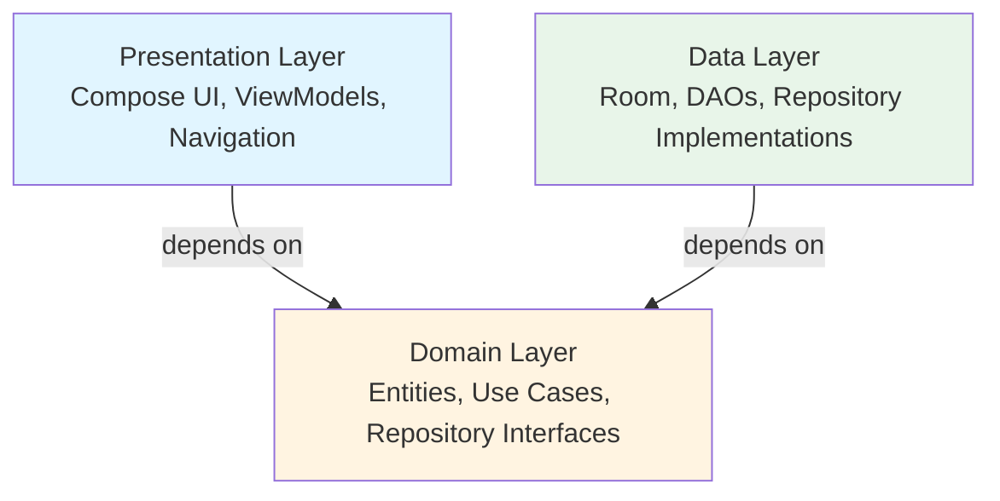
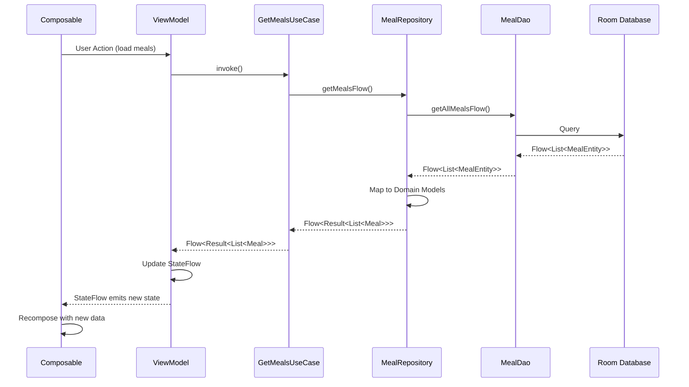
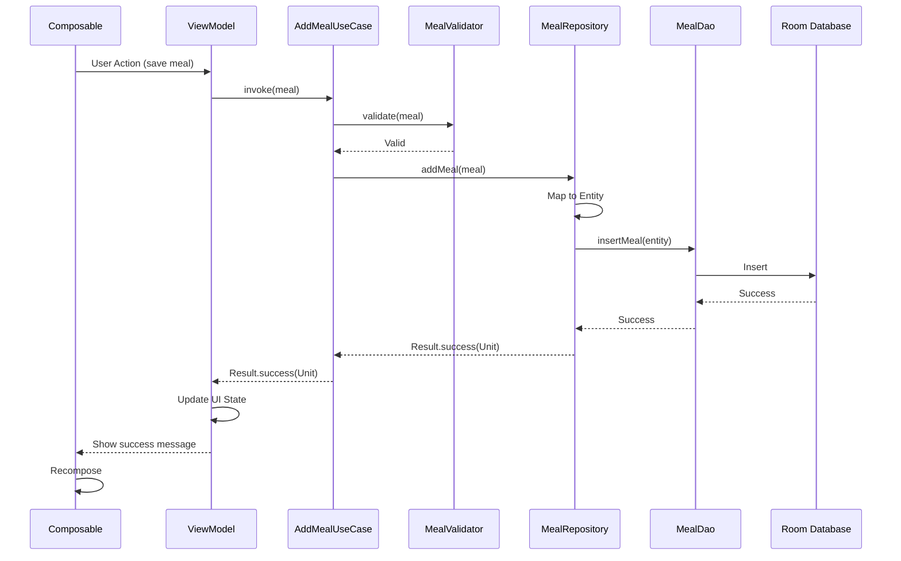

# Architecture Overview

Shoppit follows **Clean Architecture** principles with a clear separation of concerns across three main layers.

## High-Level Architecture



**Dependency Direction:** Presentation → Domain ← Data

The domain layer is at the center with no dependencies, making it the most stable and testable part of the application.

## Core Principles

### 1. Dependency Rule
- **Presentation** depends on **Domain**
- **Data** depends on **Domain**
- **Domain** has no dependencies (pure Kotlin)

### 2. Offline-First
- All data stored locally in Room database
- App works without internet connection
- Background sync when network available

### 3. Reactive
- UI updates automatically when data changes
- Flow-based data streams
- StateFlow for UI state management

### 4. Testable
- Clear separation enables easy testing
- Mock dependencies at layer boundaries
- Comprehensive test coverage

## Layer Responsibilities

### Presentation Layer (UI)

**Location:** `app/src/main/java/com/shoppit/app/ui/`

**Responsibilities:**
- Display data to users
- Handle user interactions
- Manage UI state
- Navigate between screens

**Components:**
- **Screens**: Jetpack Compose UI
- **ViewModels**: State management with StateFlow
- **Navigation**: Compose Navigation
- **Theme**: Material3 theming

**Example:**
```kotlin
@HiltViewModel
class MealViewModel @Inject constructor(
    private val getMealsUseCase: GetMealsUseCase
) : ViewModel() {
    
    private val _uiState = MutableStateFlow<MealUiState>(MealUiState.Loading)
    val uiState: StateFlow<MealUiState> = _uiState.asStateFlow()
    
    fun loadMeals() {
        viewModelScope.launch {
            getMealsUseCase()
                .collect { result ->
                    _uiState.update { 
                        result.fold(
                            onSuccess = { MealUiState.Success(it) },
                            onFailure = { MealUiState.Error(it.message) }
                        )
                    }
                }
        }
    }
}
```

### Domain Layer

**Location:** `app/src/main/java/com/shoppit/app/domain/`

**Responsibilities:**
- Define business entities
- Implement business logic
- Define repository contracts
- Handle domain errors

**Components:**
- **Entities**: Core business models (Meal, Ingredient, etc.)
- **Use Cases**: Business operations
- **Repository Interfaces**: Data access contracts
- **Error Types**: Domain-specific errors

**Example:**
```kotlin
class AddMealUseCase @Inject constructor(
    private val repository: MealRepository,
    private val validator: MealValidator
) {
    suspend operator fun invoke(meal: Meal): Result<Unit> {
        return try {
            validator.validate(meal)
            repository.addMeal(meal)
        } catch (e: ValidationException) {
            Result.failure(e)
        }
    }
}
```

### Data Layer

**Location:** `app/src/main/java/com/shoppit/app/data/`

**Responsibilities:**
- Persist data locally
- Implement repository interfaces
- Map between data and domain models
- Handle data errors

**Components:**
- **DAOs**: Room data access objects
- **Entities**: Database entities
- **Repositories**: Repository implementations
- **Mappers**: Data transformation

**Example:**
```kotlin
class MealRepositoryImpl @Inject constructor(
    private val mealDao: MealDao
) : MealRepository {
    
    override fun getMealsFlow(): Flow<Result<List<Meal>>> {
        return mealDao.getAllMealsFlow()
            .map { entities -> 
                entities.map { it.toDomainModel() }
            }
            .map { Result.success(it) }
            .catch { emit(Result.failure(it)) }
    }
    
    override suspend fun addMeal(meal: Meal): Result<Unit> {
        return try {
            mealDao.insertMeal(meal.toEntity())
            Result.success(Unit)
        } catch (e: Exception) {
            Result.failure(e)
        }
    }
}
```

## Data Flow

### Reading Data (Query Flow)



### Writing Data (Command Flow)



## Dependency Injection

**Location:** `app/src/main/java/com/shoppit/app/di/`

Hilt manages all dependencies with three main modules:

### DatabaseModule
- Provides Room database instance
- Provides DAO instances
- Singleton scope

### RepositoryModule
- Binds repository interfaces to implementations
- Singleton scope

### UseCaseModule
- Provides use case instances
- ViewModel scope

See [Dependency Injection Guide](../guides/dependency-injection.md) for details.

## Error Handling

### Domain Errors

```kotlin
sealed class AppError {
    object NetworkError : AppError()
    object DatabaseError : AppError()
    data class ValidationError(val message: String) : AppError()
    data class UnknownError(val throwable: Throwable) : AppError()
}

typealias AppResult<T> = Result<T>
```

### Error Flow

1. **Data Layer**: Catches exceptions, maps to domain errors
2. **Domain Layer**: Validates input, returns Result types
3. **Presentation Layer**: Displays user-friendly error messages

## State Management

### UI State Pattern

```kotlin
sealed interface MealUiState {
    data object Loading : MealUiState
    data class Success(val meals: List<Meal>) : MealUiState
    data class Error(val message: String) : MealUiState
}
```

### ViewModel Pattern

- Expose immutable `StateFlow<UiState>`
- Update state with `_state.update { }`
- Handle user actions with public functions
- Launch coroutines in `viewModelScope`

## Testing Strategy

### Unit Tests
- **Domain Layer**: Test use cases with fake repositories
- **Presentation Layer**: Test ViewModels with fake use cases
- **Data Layer**: Test repositories with fake DAOs

### Integration Tests
- **DAOs**: Test with in-memory Room database
- **Repositories**: Test with real DAOs

### UI Tests
- **Screens**: Test with Compose Testing
- **Navigation**: Test user flows

See [Testing Guide](../guides/testing.md) for detailed patterns.

## Package Structure

```
com.shoppit.app/
├── data/                     # Data Layer
│   ├── local/
│   │   ├── dao/              # Room DAOs
│   │   ├── entity/           # Database entities
│   │   └── database/         # Database configuration
│   ├── remote/               # (Future) Network APIs
│   │   ├── api/              # Retrofit service interfaces
│   │   └── dto/              # Network data transfer objects
│   ├── repository/           # Repository implementations
│   └── mapper/               # Entity/DTO/model conversions
├── domain/                   # Domain Layer (Pure Kotlin)
│   ├── model/                # Domain entities (Meal, Ingredient, etc.)
│   ├── repository/           # Repository interfaces
│   ├── usecase/              # Single-responsibility use cases
│   └── validator/            # Input validation logic
├── ui/                       # Presentation Layer
│   ├── meal/                 # Meal management feature
│   │   ├── MealListScreen.kt
│   │   ├── MealViewModel.kt
│   │   └── MealUiState.kt
│   ├── planner/              # Meal planner feature
│   ├── shopping/             # Shopping list feature
│   ├── common/               # Reusable composables
│   ├── navigation/           # NavHost setup and routes
│   └── theme/                # Material3 theme configuration
├── di/                       # Dependency Injection
│   ├── DatabaseModule.kt
│   ├── NetworkModule.kt
│   ├── RepositoryModule.kt
│   └── UseCaseModule.kt
└── util/                     # Utilities and helpers
```

See [Detailed Design](detailed-design.md) for complete package structure and file naming conventions.

## Key Technologies

- **Kotlin 2.0.21** - Programming language
- **Java 17** - JVM target
- **Gradle 8.7.3** - Build system with Kotlin DSL
- **Jetpack Compose (BOM 2023.10.01)** - Declarative UI framework
- **Material3** - Design system
- **Hilt 2.48** - Dependency injection with KSP
- **Room 2.6.0** - Local database with SQLite
- **Retrofit 2.9.0 + OkHttp 4.12.0** - Network layer (future)
- **Coroutines 1.7.3 + Flow** - Asynchronous programming
- **ViewModel** - State management and lifecycle awareness
- **Navigation Compose 2.7.4** - Type-safe navigation
- **Timber 5.0.1** - Logging

See [Tech Stack](../../README.md#tech-stack) for complete version information.

## Best Practices

### Do's
✅ Keep domain layer pure Kotlin (no Android dependencies)
✅ Use Flow for reactive data streams
✅ Expose immutable state from ViewModels
✅ Handle errors at repository boundaries
✅ Write tests for business logic

### Don'ts
❌ Don't access database directly from ViewModels
❌ Don't put business logic in ViewModels
❌ Don't use LiveData (use StateFlow instead)
❌ Don't create circular dependencies
❌ Don't skip error handling

## Key Architectural Decisions

### Why Clean Architecture?
- **Testability**: Each layer can be tested independently
- **Maintainability**: Clear boundaries make changes easier
- **Flexibility**: Easy to swap implementations (e.g., change database)
- **Scalability**: Well-organized structure supports growth

### Why Offline-First?
- **User Experience**: App works without internet
- **Performance**: No network latency for common operations
- **Reliability**: Not dependent on network availability
- **Data Ownership**: User data stored locally

### Why StateFlow over LiveData?
- **Kotlin-first**: Better integration with coroutines
- **Type-safe**: Compile-time safety
- **Composable-friendly**: Natural integration with Compose
- **Testability**: Easier to test with coroutines-test

### Why Hilt over Manual DI?
- **Compile-time safety**: Errors caught at compile time
- **Android integration**: Built for Android lifecycle
- **Scoping**: Automatic lifecycle management
- **Testing support**: Easy to swap implementations in tests

## Further Reading

- **[Detailed Design Document](detailed-design.md)** - Comprehensive architecture specification with package structure
- **[Data Flow](data-flow.md)** - Detailed data flow patterns and repository implementation
- **[State Management](state-management.md)** - ViewModel state patterns and Compose state
- **[Getting Started](../guides/getting-started.md)** - Setup instructions and first feature
- **[Dependency Injection](../guides/dependency-injection.md)** - Hilt configuration and patterns
- **[Testing Guide](../guides/testing.md)** - Testing strategies for each layer
